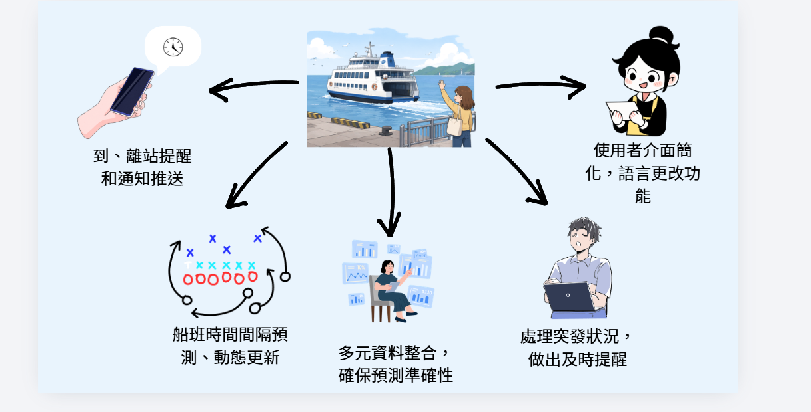

#智慧船班

# 系統功能

This contains everything you need to run your app locally.

View your app in AI Studio: https://ai.studio/apps/110c6a3a-9597-45d6-ad48-14dcc69ee649

## Run Locally

**Prerequisites:**  [Android Studio](https://developer.android.com/studio)

1. Open Android Studio
2. Select **Open** and choose the directory containing this project
3. Allow Android Studio to fix any incompatibilities as it imports the project.
4. Create a file named `.env` in the project directory and set `GEMINI_API_KEY` in that file to your Gemini API key (see `.env.example` for an example)
5. Run the app on an emulator or physical device
